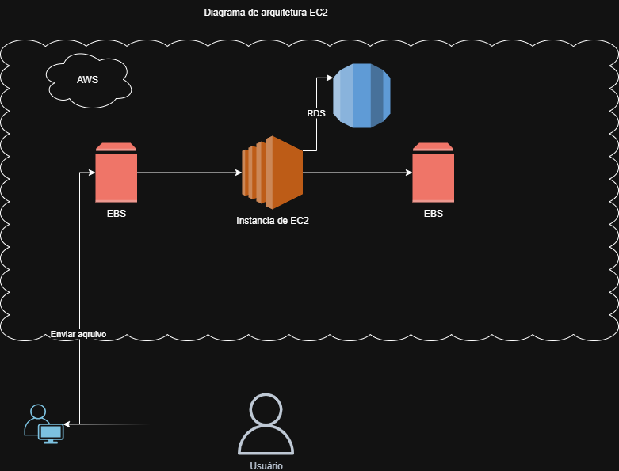

# ☁️ Desafio EC2 na AWS – DIO

Este repositório foi criado como parte do laboratório prático da plataforma **DIO (Digital Innovation One)**, com foco em **gerenciamento de instâncias EC2 na AWS**.

---

## 📚 Objetivo do Desafio

Consolidar os conhecimentos adquiridos sobre EC2, documentando o processo de criação, configuração e uso de instâncias na nuvem AWS.  
Este material serve como apoio para estudos futuros e como registro técnico da prática realizada.

---

## 🛠️ Tecnologias Utilizadas

- Amazon EC2  
- Amazon EBS  
- Amazon RDS  
- AWS Console  
- Git e GitHub  

---

## 📷 Diagrama de Arquitetura

O diagrama abaixo representa a estrutura utilizada durante o desafio:

---

## ✍️ Anotações e Insights

- EC2 é uma máquina virtual escalável que pode ser configurada com diferentes tipos de instância.
- O EBS permite adicionar volumes persistentes à instância EC2.
- O RDS facilita a gestão de bancos de dados relacionais sem precisar configurar servidores manualmente.
- É importante configurar corretamente as **Security Groups** para permitir acesso via SSH e à porta do banco de dados.
- O uso de **chaves privadas (.pem)** é essencial para autenticação segura.

---

## 🚧 Status do Projeto

> ⚠️ Este projeto ainda está em desenvolvimento.  

---

## 📎 Referências

- [Documentação oficial da AWS EC2](https://docs.aws.amazon.com/ec2/)
- [Guia de boas práticas em arquitetura AWS](https://aws.amazon.com/architecture/)
- [Curso DIO – AWS Cloud Practitioner](https://www.dio.me)

---

## 👩‍💻 Autora
**Juliana Rodrigues de Souza**  
